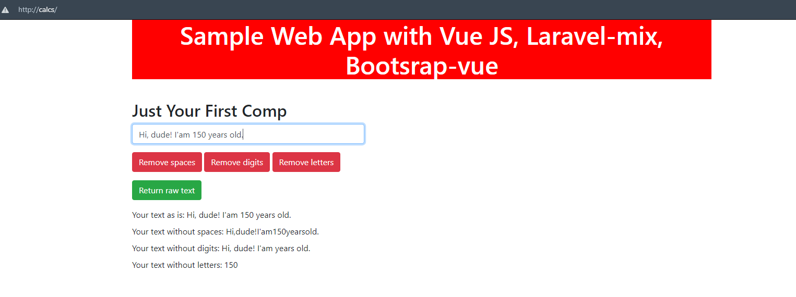

# Laravel-mix with Vue js and Bootsrap-vue

## ENG

***
**The app use:**
* Vue Js https://ru.vuejs.org
* Bootsrap-vue (UI) https://bootstrap-vue.org
* Laravel-mix (to build the project) https://laravel-mix.com/

**The app needs to start (You can use Docker https://www.docker.com/, Open Server https://ospanel.io/ and etc.):**
* **php**
* **web server** (apache or nginx)
* **nodejs** to build the project
* **npm** to work with dependencies

**To start:**
* clone repository: **git clone git@github.com:quoterbox/laravel-mix-vue.git**
* run in your console (example, **PowerShell**, terminal in **PhpStorm** or **GitBash**) from your project folder to install dependencies: **npm install**
* Use one of the commands from **package.json** to build **JS** and **SCSS**, example, **npm run dev** or **npm run prod**
* Start your web-server and go to **http://localhost/index.php** (or your own local server address)

**Build setup**
* All settings in the **webpack.mix.js**
* Also, you can simplify current setup in **webpack.mix.js** like this:

***
`mix.js('./src/js/app.js', 'js/').vue().setPublicPath('dist')
.sass('./src/scss/style.scss', 'css/').version().setPublicPath('dist');`
***

## RU

***
**В данном примере простого приложения использовались:**
* Vue Js https://ru.vuejs.org
* Bootsrap-vue (внешнее оформление) https://bootstrap-vue.org
* Laravel-mix (сборка проекта) https://laravel-mix.com/

**Для работы и запуска вам необходимы (вы можете использовать Docker https://www.docker.com/, Open Server https://ospanel.io/ и др.):**
* **php**
* **web server** (apache или nginx)
* **nodejs** для сборки проекта
* **npm** для работы с доп. пакетами и зависимостями

**Для запуска**
* склонируйте репозиторий: **git clone git@github.com:quoterbox/laravel-mix-vue.git**
* запустите в консоли (например, **PowerShell**, терминал из **PhpStorm** или консоль **GitBash**) из папки, где будет проект, команду установки зависимостей: **npm install**
* для сборки **JS** и **SCSS** используйте одну из необходимых вам команд из **package.json**, например, **npm run dev** или **npm run prod**
* затем запустите свой веб сервер и откройте страницу **http://localhost/index.php** (либо тот адрес, по которому разместили)

**Настройка сборки**
* настройка сборки производится в **webpack.mix.js**
* Текущую настройку в webpack.mix.js можно упростить до 2-строк:

***
`mix.js('./src/js/app.js', 'js/').vue().setPublicPath('dist')
.sass('./src/scss/style.scss', 'css/').version().setPublicPath('dist');`
***
